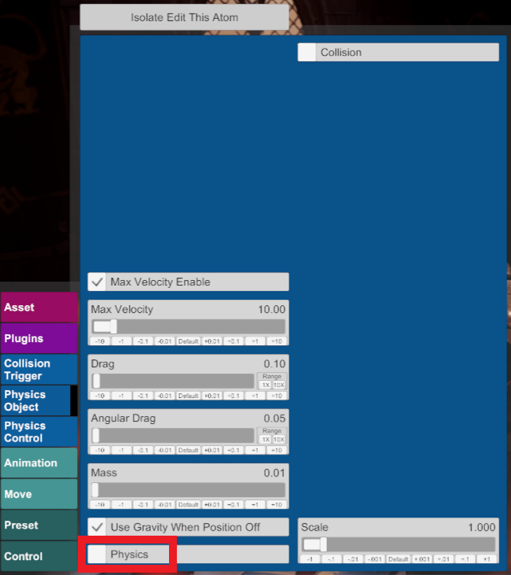

# VaM CUA Superglue

Stick your CUAs where they belong! Automatically remove lag from CUAs attached to Person atoms, such as hair and accessories.

https://user-images.githubusercontent.com/103406651/175865924-820537c2-0d5a-4efb-913e-cc4079f703fd.mp4

Look: Devil Mercy by OniEkohvius (not included)

## Using this plugin

Add the plugin as a **Session plugin**. Scene plugin is also supported but not recommended, as having multiple instances of the plugin loaded will cancel out the effect.

That's it! The rest is automatic.

## Troubleshooting

The effect only works on CustomUnityAsset atoms with Physics disabled. If you think your CUA should be glued but it's not, check that the following settings are set:

 - Physics Options 
   - Physics (False)

 - Control
   - Link To Atom (as desired)
   - Position, Rotation (Parent Link)

   
If you run into any further issues, submit an Issue on Github or message me on Discord (Pineapler#3512).

## License

[MIT](LICENSE.md)
