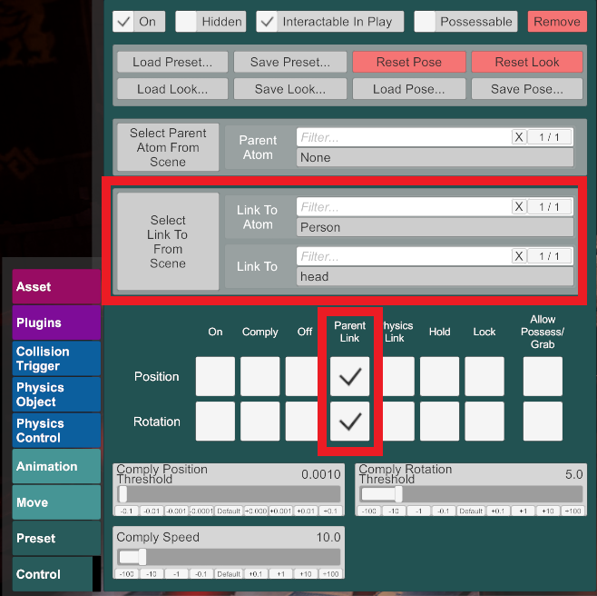

# VaM CUA Superglue

Stick your CUAs where they belong! Automatically remove lag from all CUAs attached to Person atoms, such as hair and accessories.

https://user-images.githubusercontent.com/103406651/175865924-820537c2-0d5a-4efb-913e-cc4079f703fd.mp4

Look: Devil Mercy by OniEkohvius (not included)

## Using this plugin

Add the plugin as a **Session plugin**. One instance is all you need! Any more will cancel out the effect.

That's it! The rest is automatic.

To load the plugin every time the game starts, add the plugin then select Session Plugin Presets > Change User Defaults > Set Current as User Defaults.

## Troubleshooting

The effect only works on CustomUnityAsset atoms with Physics disabled. If you think your CUA should be glued but it's not, check that the following settings are set:

 - Physics Options 
   - Physics (False)

 - Control
   - Link To Atom (as desired)
   - Position, Rotation (Parent Link)

   
If you run into any further issues, submit an Issue on Github or message me on Discord (Pineapler#3512).

## License

[MIT](LICENSE.md)
